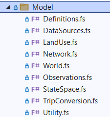

Scaper
============
### A dynamic discrete choice model for activity generation and scheduling

-------

Stephen McCarthy ([@mccsteve](https://github.com/mccsteve)) is the primary author of this code and documentation.

Quick links to reference documents/guides:
- [Theory behind the Scaper model](docs/ScaperTheory.md)
- [Command line options for running the program](docs/CommandLineOptions.md)
- [Changing input data](docs/InputData.md)
- [Defining the state space](docs/StateSpace.md)
- [Specifying the utility function](docs/Utility.md)

--------------

This page gives an introduction to this repository's implementation of the microsimulation model for travel behaviour called _Scaper_. This repository contains an implementation of Scaper in F# mainly written by Stephen McCarthy. It is made public according to the MIT License by the agreement of the authors listed in the [license](LICENSE).

Scaper is a travel behaviour model which generates full-day agent schedules. It is a dynamic discrete choice model: agents start at the beginning of the day and make sequential, chronological decisions which maximize the total utility of the decisions, which is the immediate reward of the action taken plus the expected utility of the resulting state. The model has been academically developed by several authors including Karlström ([2005](https://trid.trb.org/View/759266)), Jonsson & Karlström ([2005](https://urn.kb.se/resolve?urn=urn:nbn:se:kth:diva-71723)), Blom Västberg et al. ([2020](https://doi.org/10.1287/trsc.2019.0898)) and McCarthy ([2024](https://urn.kb.se/resolve?urn=urn:nbn:se:kth:diva-356350)). The documentation incldues a page describing the [theory of Scaper](docs/ScaperTheory.md) which is recommended for reading to understand how the model works.

## Getting and running Scaper

To get a copy of Scaper, download the source code from this repository or fork it into a new Github respository and clone.

You will need .NET 9.0 to run the program. All of Scaper's dependencies are available from publically-available Nuget packages which are automatically loaded by .NET.  

Your model [input files](docs/InputData.md) should be in the folder `models/MODELFOLDER/input` where you specify a `MODELFOLDER` in the _DataSources_ module for your specific model. We have provided an example set of input data with model folder `UmeaExample` so you can run the program directly after downloading it.  

Scaper is intended to be run primarily from the command line, and has a number of commands and options available through the command-line interface which are documented in this [page](CommandLineOptions.md). You can also run Scaper from a .NET integrated development environment such as Visual Studio, which is recommended for model development.

The command to run the program is `dotnet run -c Release --project /PATH/TO/REPO/source/Scaper/`, where `PATH/TO/REPO` is the path to your local copy of the Scaper repository.

If you are running Scaper regularly from the command line in a Linux environment, it may be useful to [create an alias](https://askubuntu.com/questions/17536/how-do-i-create-a-permanent-bash-alias) so you replace the long `dotnet` command with a more succinct command. The examples below assume an alias has been created called `scaper`.

Scaper runs log their output in log files in the folder `models/MODELFOLDER/logs/YY-MM-DD` where the model folder `MODELFOLDER` is defined in the _DataSources_ module and the subfolder name is the date you run the program. By default, the program will not print output to the console; you can duplicate the log file output to the console with the option `--console` on any Scaper command.

## Simulating agent daypaths

The first basic purpose of the Scaper implementation is to simulate the different activities and trips agents take over a day, or their daypaths. To do this, you need a defined Scaper model with estimated parameters, such as provided in the example model input.

To run a simulation, run the program with the [`sim`](docs/CommandLineOptions.md#sim) command. For instance, to simulate daypaths for 500 agents using 100 sampled zones, 8 maximum threads for parallelization, and input output to the console as well as a log file, run the program with the following options:

```
scaper sim -t 500 -z 100 -x 8 --console
```

The simulation output is saved in the folder `models/MODELFOLDER/sim/YY-MM-DD` with the model folder `MODELFOLDER` defined in the _DataSources_ module; the subfolder name is the date you run the simulation.

Simulation output is stored in a CSV file where each row is a trip made by a particular agent. The output looks like this:

| IndID | LatentClass | Activity | Mode    | Origin | Destination | DepartureTime | TravelTime | ArrivalTime |
|------ |------------ |--------- |-------- |------- |------------ |-------------- |----------- |------------ |
| 3214  | 0           | Work     | Car     | 907    | 52          | 7:30          | 14:35.9    | 7:44        |
| 3214  | 0           | Other    | Car     | 52     | 44          | 14:04         | 11:53.2    | 14:16       |
| 3214  | 0           | Home     | Bike    | 44     | 907         | 14:26         | 14:14.4    | 14:40       |

Departure and arrival times are truncated to the minute, though internally the program represents them exactly. Origin and destination are given as indices in the order of the zones input file, `zones.csv`. If the model has two or more latent classes, the class chosen by the individual is recorded for all their trips.

The F# Scaper implementation does not have any built-in functionality to analyze or visualize output; you perform your own analysis and visualization with the raw CSV output file.  

## Estimating a model

The second fundamental function of the Scaper implementation is to estimate Scaper models. Estimation is a two-step process: first, you generate sampled choicesets for your observed data, then you estimate the model using these choicesets.

As Scaper uses itself to generate choicesets, you need to have an existing set of model parameters to start the estimation process. The better these parameters are, the more useful the choiceset will be for estimation. Our usual practice is to start with a set of guess parameters (adapting estimates from another context/model if possible), use trial and error until good estimates can be obtained, then iteratively re-estimate with new choicesets until the estimates reach fixed values from iteration to iteration. Estimates should be validated using simulated data to ensure parameters generate reasonable output.

Choicesets are stored in a format which is independent of the model's utility function, so you can use the same generated choiceset to estimate multiple model specifications. This is advantageous as the models' log likelihood values can be meaningfully compared against each other to help in model selection. A caution, however, that changing the definition of `Agent` or `Trip` or the types they depend on (specifically the `Activity` and `Mode` enums) will make previously-generated choicesets unusable as these types are serialized directly into the choiceset file.

### Generating choicesets

Choiceset sampling is necessary because the full set of daypaths possible for an agent to take through any Scaper state space is too large to feasibly use for estimation. When generating choicesets, the program stores the observed data along with a given number of simulated (non-observed) alternate daypaths. To run choiceset generation, run the program with the [`cs`](docs/CommandLineOptions.md#cs) command. For instance, to generate choicesets for 500 agents with 100 sampled zones, 300 alternates generated per choiceset, 8 maximum threads for parallelization, and output displayed in the console and log file, run:

```
scaper cs -t 500 -z 100 -a 300 -x 8 --console
```

Choicesets are stored in the folder `models/MODELFOLDER/cs/YY-MM-DD` with the model folder `MODELFOLDER` defined in the _DataSources_ module; the subfolder name is the date you run the simulation. Due to the large amount of data generated, choicesets are stored as Parquet files using [Parquet.NET](https://aloneguid.github.io/parquet-dotnet/starter-topic.html) which directly serializes the `Agent` and `Trip` types.

### Performing estimation

To estimate using your choiceset, you first need to modify the `ChoicesetInputFile` literal in the _Utility_ module to point to your newly-generated choiceset Parquet file. You only need to specify the filename, not the subfolder name: the program will find the correct file unless there files with duplicate filenames.

To perform estimation, run the program with the [`est`](docs/CommandLineOptions.md#est) command. For instance, to estimate with 9 maximum threads for parallelization and output to both console and log file, run: 

```
scaper est -x 8 --console
```

The result of the estimation is presented in the log file with parameter values and standard errors. The full parameter set, including non-estimated parameters, are also saved into a CSV parameter file in the folder `models/MODELFOLDER/est/YY-MM-DD`. The saved parameter CSV file can be directly used for future simulations by specifying the filename in the `ParameterInputFile` literal in the _Utility_ module.

## Modelling in Scaper

> [!IMPORTANT]
> You will need to program in F# to build models in Scaper.

If you are using Scaper to perform modelling, you won't just be running simulations from and estimating the basic specification currently implemented. You will be updating the program to use your own input data and to specify the state space and utility function to meet your modelling needs.

Modelling within the F# version of Scaper is mainly achieved within the source code. There is no external config file, and the command line options are focused on model runs rather than model specification.



The source code is organized so that all basic modelling is done by modifying code in the _Model_ folder, shown to the right in F# load order.

The documentation contains three pages with guides for modellers working with Scaper:
- [Changing input data](docs/InputData.md): a guide to adapting Scaper to your local context which covers land use, network and observations data.
- [Defining the state space](docs/StateSpace.md): a guide to how the Scaper state space works and how to modify it to your modelling needs.
- [Specifying the utility function](docs/Utility.md): a guide to changing the utility function to your desired specification. 

### Source code folder structure

While the _Model_ folder contains all the files that you should need to modify as a Scaper modeller, it is worth knowing what the modules in the other folders contain. In the order that they load in F#, the folders are:
- _Helpers_: miscellaneous modules with code that is not directly model-related but is used by model code for efficient array calculations (_Span_), convenience functions (_Helpers_), progress displays (_Progress_) and broadcastable matrices (_Matrix_).
- _Estimation_: functions to estimate a latent class model using the [BFGS](https://en.wikipedia.org/wiki/Broyden%E2%80%93Fletcher%E2%80%93Goldfarb%E2%80%93Shanno_algorithm) algorithm and a bracketing line search. The code in this folder is not aware of the Scaper model or the specific implementation, and indeed could be used to estimate any latent class model by calling the `LogLikelihoodLC.makeLCLLCostFunc` function with the appropriate input. It is also used to estimate zone sampling parameters.
- _Model_: definition of a particular Scaper model specification, including the input data, state space and utility function. This folder is discussed in detail in the guides linked to above.
- _Core_: fundamental Scaper functionality to calculate the recursive value function (_UtilityFuncs_ and _ValueFunction_) and perform zone sampling (_ZoneSampling_). This folder also contains the top-level program logic for simulation of day paths (_Simulation_), generation of choice sets for estimation (_Choicesets_), and running the model estimation (_Estimation_).
- _Derivatives_: functions to run Scaper including the calculation of marginal utilities of travel time and cost, in order to calculate values of travel time (VTTS). If you are working with VTTS within Scaper you will need to be familiar with this folder, and you may need to modify the _Derivatives_ module to calculate the appropriate marginal utilities.
